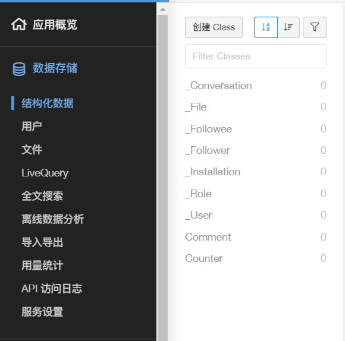
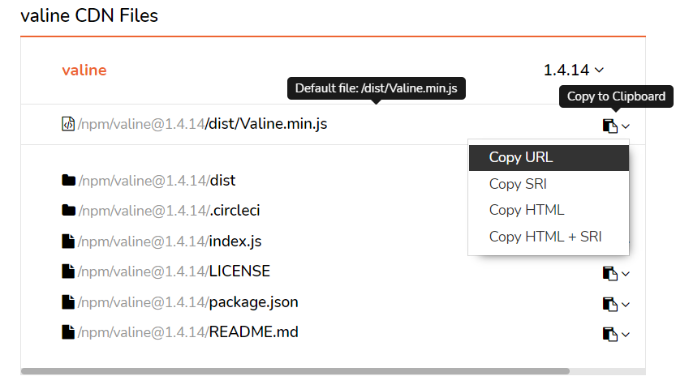

在配置好 Hexo 之后，第一件事就是选一个好看的主题，之前看了许多别人的博客，我对NexT这款主题喜欢很久了，于是我赶紧打开了他的官方文档进行配置，于是第一个坑出现了，你按照“官方文档”进行配置之后会发现无法正常运行，在这里记录一下如何找到正确的文档以及配置中文和 Valine 评论功能。

<!-- more -->

## 找到正确的官方文档

很多人，包括我，直接在搜索引擎中搜类似“hexo next”的关键词后，基本都会点进[这个链接](https://theme-next.iissnan.com/)，但是这个链接中的文档看似有模有样，实际上已经是过时很久的了，最新的[官网](https://theme-next.js.org/)和[文档](https://theme-next.js.org/docs/getting-started/)的地址是[https://theme-next.js.org/](https://theme-next.js.org/)，并且内容都是英文的。

找到正确的网站，按照 Getting Started 页面中的提示一步一步安装 NexT 基本就不会有问题了。

## 配置中文

在旧的文档中，我找到了关于语言的配置，默认是英文的。如果我们想把网站中由 NexT 配置的菜单、侧栏等选项卡的语言改成中文，就需要修改 **Hexo** 的 `_congif.yml`，注意，这里要修改的不是 NexT 的配置文件，而是 Hexo 的配置文件。

打开 `_congif.yml` 找到 `language`，这里就是第二个坑了，旧的文档中写道要配置简体中文则要将这一行改成 `language: zh-Hans`，然而当你这样配置之后，网站就会出现类似藏文（不知道是不是藏文）的乱码，正确配置简体中文的代码应该是：

```yaml
language: zh-CN
```

## 添加 Valine 评论系统

我在浏览了一些对比评论系统的文章后，决定选用 Valine 作为评论系统，我觉得它和 NexT 主题的整体风格比较搭配，而且 Valine 也是被 NexT 默认支持的评论系统。

Valine 和 NexT 的文档中都没有详细地写如何配置 Valine，于是我凭直觉应该是将 **NexT** 的配置文件中的 `valine` 下的 `enable` 改为 `true` 并且配置上在 LeanCloud 中创建好的应用的 appid 和 appkey，测试一下发现，果然不起作用，查了一下网上的资料加上自己的摸索后，修改了 LeanCloud 的设置，并且修改了配置文件中的三处，让 Valine 顺利运行。

首先，进入 LeanCloud 控制台中你所创建的应用里，点击左侧导航栏中的 `数据存储 -> 结构化数据`，创建两个 Class，分别是 Comment 和 Counter，权限设置为所有人。



然后在[https://www.jsdelivr.com/package/npm/valine](https://www.jsdelivr.com/package/npm/valine)中复制最新的 Valine 的 CDN 链接



打开 **NexT** 的配置文件，修改以下三个地方：

```yaml
# 修改 1
comments:
	# ...
	active: valine
	# ...
# 修改 2
valine:
	enable: true
	appid: 你的 appid
  	appkey: 你的 appkey
  	# ...
# 修改 3
valine: https://cdn.jsdelivr.net/npm/valine@1.4.14/dist/Valine.min.js # 你刚刚复制的CDN链接
```

到这里 Valine 就可以正常使用了，记得在不需要的页面关闭评论功能，比如标签页面和分类页面就不需要评论。

```yaml
title: tags
date: 2021-06-29 22:55:07
type: tags
comments: false
```

