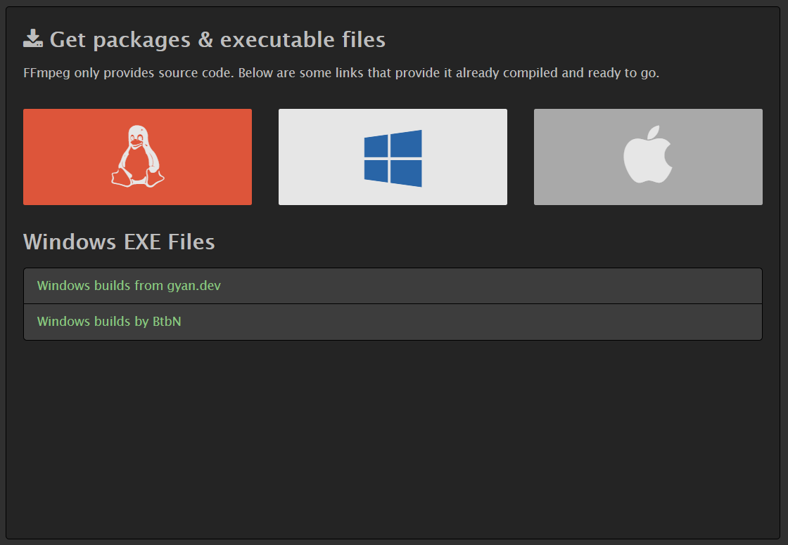
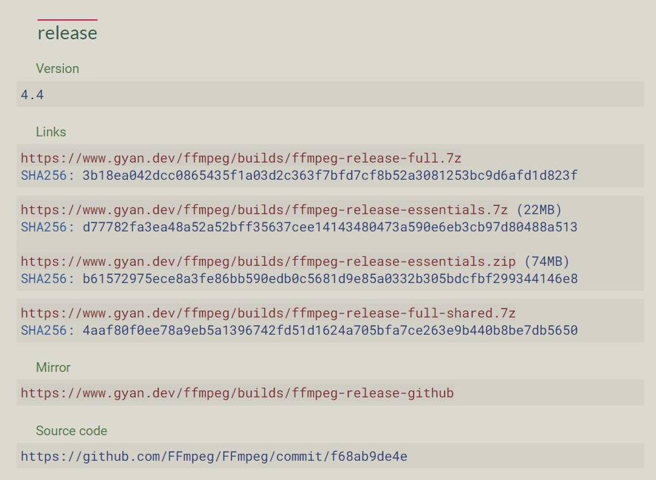
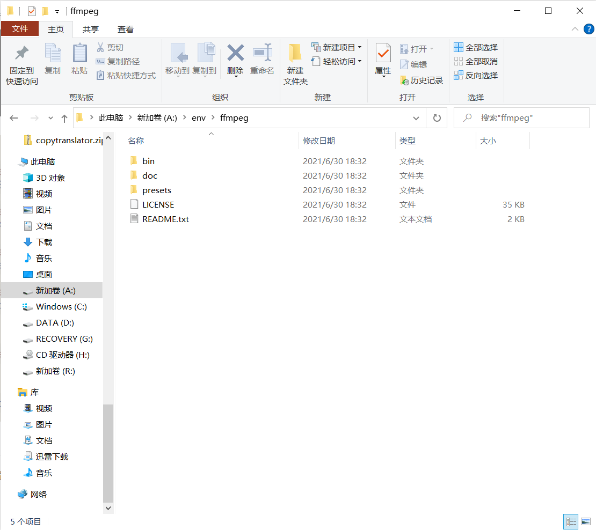
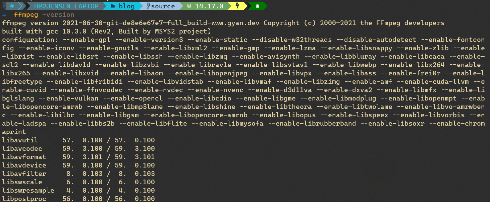

you-get 是一个从网络上下载音频、视频、图片等资源的命令行工具，详细的介绍可以去他的[官网](https://you-get.org/)，在 Windows 下安装完 you-get 之后，虽然可以正常地进行下载，但是下载完的视频和音频常常是分开的，为了解决这个问题，我们需要安装 **FFmpeg**。

<!-- more -->

## 下载 FFmpeg

首先，我们进到 FFmpeg 官网的[下载](https://www.ffmpeg.org/download.html)页面，鼠标悬浮在 Windows 徽标上，就可以看见官方推荐的两个供我们进行下载的地址，上面一个是 [gyan.dev](https://www.gyan.dev/ffmpeg/builds/) 提供的镜像，下面一个是 Github 上的 Releases 页面，用上面一个链接下载可能会快一些。

在页面中的 release 栏中找到你想要下载的版本，直接点击即可下载。

## 配置环境变量

下载完成后，我们需要将 FFmpeg 的可执行文件所在的文件夹添加到环境变量中，这样 you-get 才能正常使用。

将下载下来的压缩包解压到任意位置，并复制 **bin** 文件夹的路径，比如我解压 FFmpeg 的路径为  `A:\env\ffmpeg`，那么 bin 文件夹的位置就是 `A:\env\ffmpeg\bin`，看图理解还是很清晰明了的。

接着进入 Windows 的设置，依此点击 **系统 -> 关于**，在右边栏找到 **高级系统设置**，在弹出的选项卡中点击 **高级**，然后点击 **环境变量**，在 **Path** 中加上刚刚复制的那一条。

重新开一个命令行，输入 `ffmpeg -version`，如果输出了一堆类似下图的信息，那么说明已经设置成功了。

这时候，我们再用 you-get 下载视频时，在下载完成后会有一个类似 `Merging video parts... Merged into xxx` 的提示，这时候再看下载下来的文件就已经合并成一个了。
