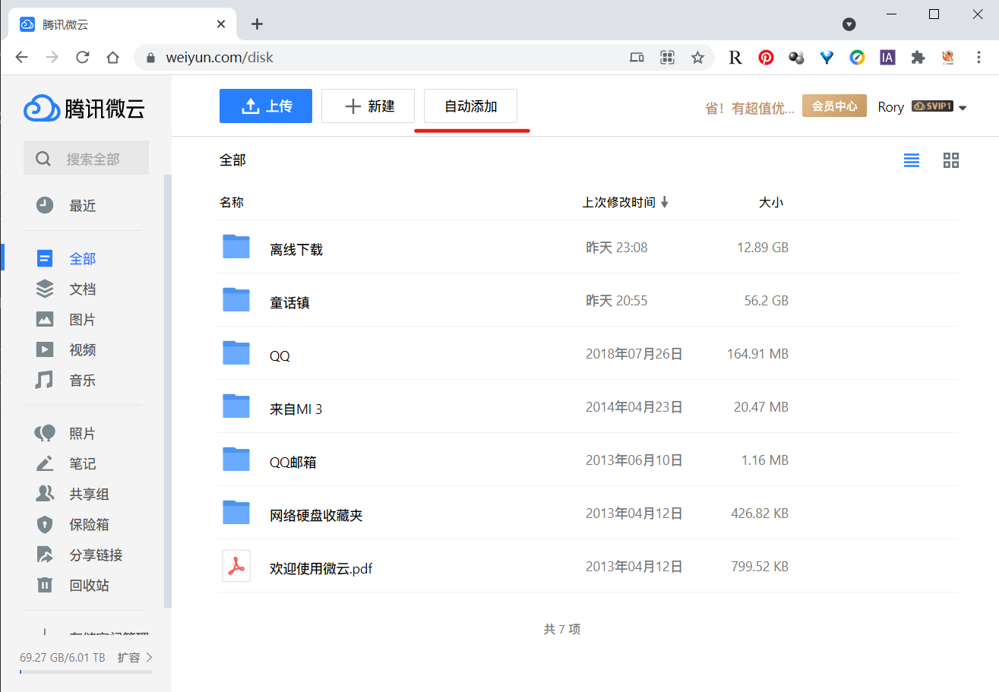
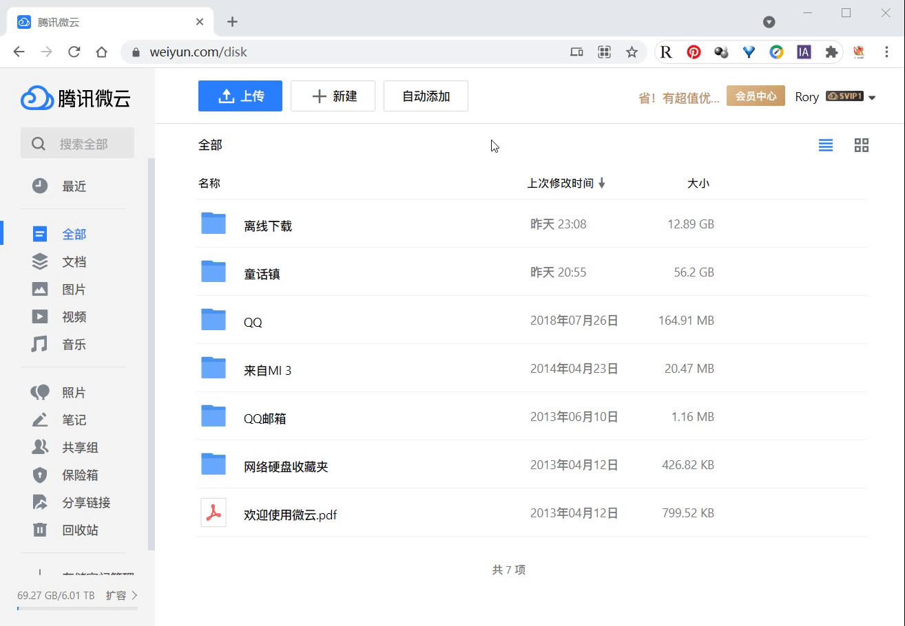

事情是这样的，最近发现了一个宝藏网站 [yyets.dmesg.app](yyets.dmesg.app)，解决了我找高清电视剧资源难的问题，但是又出现了新的问题，网站里面一些高清的资源是电驴资源，我试了很多软件，发现只有迅雷这个吸血鬼离线下的动，可是迅雷的定价并不便宜，于是我就四处寻找替代品，最后发现微云定价便宜而且离线下载也能下的动很多资源（但是确实还是有一些下不了），不过也可以算是差强人意。使用下来发现，微云有一个非常不方便的点，那就是不支持批量添加链接，手动添加一个链接需要经过五步：点击新建 -> 点击离线下载 -> 点击链接下载 -> 填入链接 -> 点击下一步，总共点击四次，CTRL + V 一次，添加一个还好，电视剧懂不懂十几二十集，这谁受得了啊，于是我开始着手解决这个问题。

<!-- more -->


## 最初的想法：自动批量添加

本着出现问题就解决~~提出问题的人~~问题的想法，我在 GitHub 上搜了一圈有关于微云的仓库，发现大多数都是模仿网盘页面的，还有一个7、8年前的仓库，用来转真实链接的，遂放弃。又在网上找有没有人写类似的 API，还真给我找到了，而且还是官方的：[腾讯微云开放平台TWOA](https://open.weiyun.com/)，进入这个页面我不禁感慨有些简陋，再进一步看看他的功能，好家伙，我要的他全都有，真不愧是官方出品。当我满心欢喜地准备用的时候发现，发送请求中需要带上 `client_id`、`client_secret` 等需要申请的参数，我找了大半天，也没发现申请的入口，遂再次放弃。

后来又想到了用模拟点击的方式自动点击上传，于是用 puppeteer 写了个脚本，怎么用怎么不舒服，还有一堆 bug，遂再再次放弃。

## 最终实现：浏览器脚本

在多次尝试之后，我觉得完全自动化已经很难继续往下走了，于是考虑不那么自动化，反正是要进浏览器的，那不如写一段 JS ，每次要用的时候贴到 console 里，我点一下添加离线下载的按钮，他自动帮我转到添加链接的 tab，并且帮我填如剪贴板中的内容，这样看来也还不错，不过每次还是得点击 “新建” 和 “离线下载” 两个按钮，要不怎么说懒是第一生产力呢，我直接在界面上添加一个按钮，点一下相当于点两下不是更好吗？那再进一步，不要每次手动把脚本粘进来，直接做成浏览器扩展脚本不是更好吗？而 Tampermonkey 就提供了很好的支持。

### 思路

首先在页面上添加一个 **自动添加** 的按钮，点击之后就相当于点击了 “新建” 和 “离线下载” 两个按钮，**监听这个按钮的点击事件**，等待跳出的对话框完成加载后，点击 “链接下载” 按钮，并在 textarea 中填入剪贴板中的内容。

在实验的过程中，有几个比较坑的地方，在页面变化的时候是需要等待我们需要的元素加载的，本身只想用原生功能实现（其实是不知道 Tampermonkey 支持引入库），所以就用 `setInterval` 尝试解决了，拿等待对话框弹出作为例子，因为我们要点击弹出的对话框中 “链接下载” 的按钮，因此需要等待加载，具体代码如下：

```javascript
// 链接下载 按钮的选择器
const subTabSelector = 'xxx' // 太长就不写了
// 被点击后，等待跳出的对话框完成加载后，点击 链接下载 按钮，并填入剪贴板中的内容
let tabButton = document.querySelector(subTabSelector)
// 等待对话框完成加载
const waitButton = setInterval(() => {
    tabButton = document.querySelector(subTabSelector)
    if (tabButton !== null) {
        tabButton.click()
        // 这个函数表示填入剪贴板中的内容
        setURL()
        clearInterval(waitButton)
    }
}, 100)
```

完整的代码在 Github 上，[点击直达](https://github.com/Jortana/weiyun-auto-add)。

### 使用效果

在完成安装之后，当你登录到微云的时候，也就是你的地址栏显示类似 `https://www.weiyun.com/disk*` 这种形式的时候，界面上会多一个 **自动添加** 的按钮，如下图所示：



点击 **自动添加** 按钮，脚本会帮你将你的 **剪贴板** 中的内容添加到离线下载的列表中



配合一些分享链接的站点，可以实现非常快速的多个链接的添加，比如配合[人人视频分享站](https://yyets.dmesg.app/home)


### 安装

通过 OpenUserJS 安装脚本: **[点我](https://openuserjs.org/scripts/jortana/Weiyun_Auto_Add_Task_%E5%BE%AE%E4%BA%91%E8%87%AA%E5%8A%A8%E5%A1%AB%E5%86%99%E7%A6%BB%E7%BA%BF%E4%B8%8B%E8%BD%BD%E9%93%BE%E6%8E%A5)** 

然后点击页面右上角的 `Install` 进行安装
